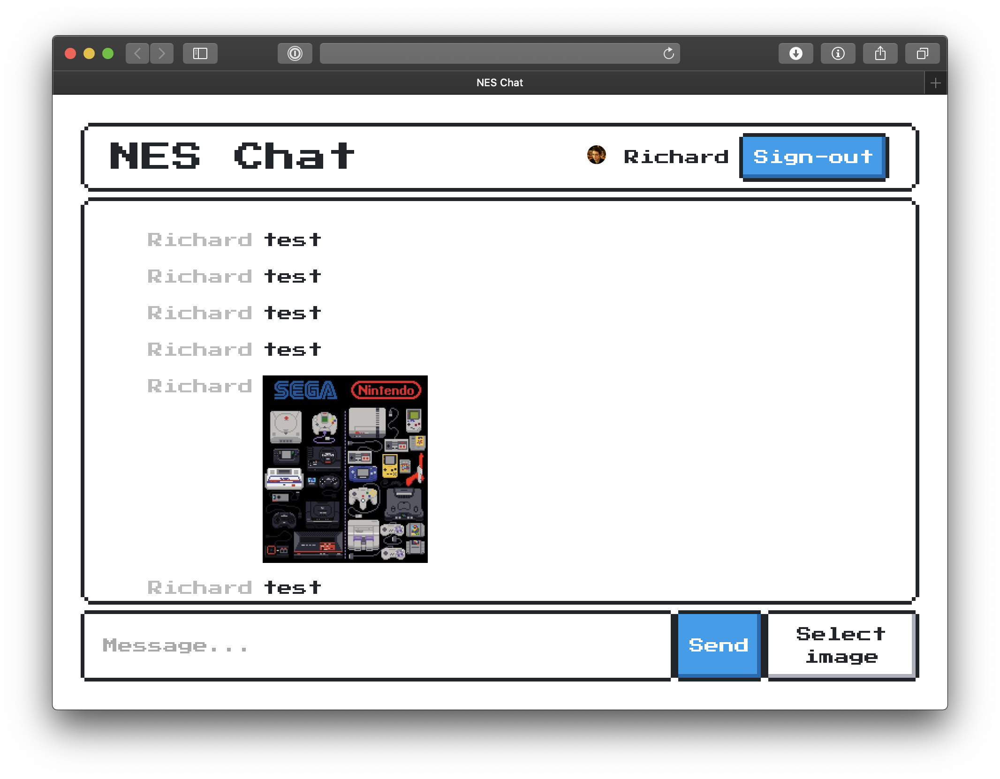

# NES CHAT

---

Note, the correct permissions have to be set on the Firebase storage backends. It's probably best to follow the tutorial linked below first.

---

This folder contains the starting code for the [Firebase: Build a Real Time Web Chat App Codelab](https://codelabs.developers.google.com/codelabs/firebase-web/).

If you'd like to jump directly to the end and see the finished code head to the [web](../web) directory.
